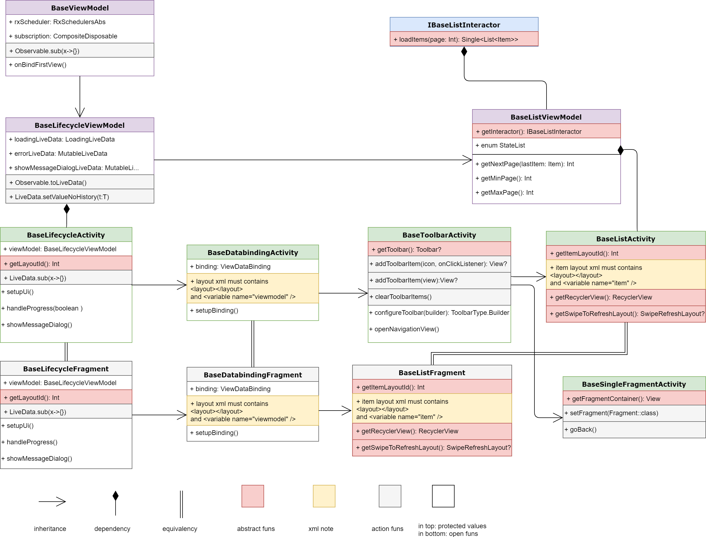

# RoixArchitectureTemplates

### Global architecture templates for android

This is a clean mvvm architecture with DI, included base list and toolbar screens logic, configured themes, styles, values etc. 
After every template use (probably except only Architecture Template), the project is able to compile. This allows to work with architecture and DI, as a black boxes.

### Main advantages
- It is a framework!
- Large ability to customize
- Base Toolbar Activity provides work with navigation view and custom toolbar items
- Base List Screen provides pagination, pull to refresh and advansed list state (loadings, errors etc).
- Base Single Fragment Activity managed work with fragment stack, detached fragments etc.

### Templates
```
1. Architecture: 
Create base classes and the first screen and the repository, and configure resourses, manifest, .gradle files.

2. Screen: 
Add view (activity or fragment), vievmodel, interactor class-interface pairs. And resolving thees in a DI tree.  
There is able to provide repository in interactor inside the template. Screen can be list, toolbar, base etc.

3. Repository: 
Add repository class-interface pair with resolved DI.

```

### Usage
```
1. Download or clone this repository 

2. Copy (RoixArchitectureApplication , RoixMVVMRepository , RoixMVVMScreen) folders
to folder ${AndroidStudioDir}/plugins/android/lib/templates/activities

3. Restart Android Studio

3. Choose File->New->Roix MVVM Architecture->template

4. Use the template

```


### Tools / Libs Utilized
- Jetbrains Kotlin : https://kotlinlang.org/
- Android Architecture Components : https://developer.android.com/topic/libraries/architecture/index.html
- Databinding : https://developer.android.com/topic/libraries/data-binding/index.html
- Toothpick Dependency Injection : https://github.com/stephanenicolas/toothpick
- Dagger2 (in dagger_version branch) : https://github.com/google/dagger
- RxJava 2 / RxAndroid : https://github.com/ReactiveX/RxJava
- Retrofit 2 : http://square.github.io/retrofit/
- Picasso : http://square.github.io/picasso/
- Permission dispatcher : https://github.com/permissions-dispatcher/PermissionsDispatcher
- Constraint Laoyut, Support Library etc

### Basic architecture scheme


### Inheritance structure


### StateList enum graph


